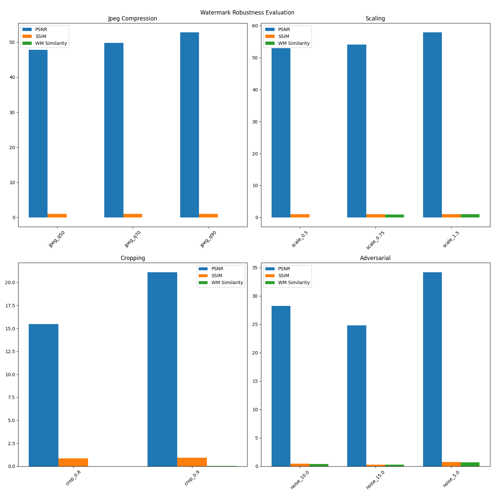

# NeuralSentinel



## NeuralSentinel

NeuralSentinel is a comprehensive solution for detecting and defending against deepfakes using a multi-layered approach. It combines watermarking, traditional image analysis, and advanced machine learning techniques to provide robust media authentication and manipulation detection.


## Overview

This system provides a robust framework for:

- **Watermarking** authentic images to verify their integrity  
- **Detecting** potential deepfakes using multiple analysis methods  
- **Managing and tracking** verified versus manipulated media  
- **Providing a user-friendly dashboard** for monitoring and analysis  


## Key Features

- **Watermarking System:** Embeds secure digital signatures into images  
- **Deepfake Detection Engine:** Utilizes traditional image analysis and ensemble machine learning for reliable detection  
- **White-listing Mechanism:** Maintains a registry of known authentic images to reduce false positives  
- **User Dashboard:** Web interface for uploading, testing, and monitoring images  
- **Robust API:** RESTful endpoints for seamless integration with other applications  


## Installation

1. Clone the repository:

   ```bash
   git clone https://github.com/MLNexusHub/NeuralSentinel.git
   cd NeuralSentinel
   ```

2. Create and activate a virtual environment:

   ```bash
   python -m venv myenv
   source myenv/bin/activate  # On Windows: myenv\Scripts\activate
   ```

3. Install dependencies:

   ```bash
   pip install -r requirements.txt
   ```

4. Set up environment variables:

   ```bash
   cp .env.example .env
   # Edit the .env file with your configuration as needed
   ```


## Usage

### Starting the Server

Run the Flask-based dashboard server:

```bash
python dashboard.py
```

Access the dashboard at: [http://localhost:5000](http://localhost:5000)


## API Endpoints

| Endpoint      | Description                                        |
| ------------- | -------------------------------------------------- |
| `/api/upload` | Upload and watermark an image                      |
| `/api/test`   | Test an image for watermark and deepfake detection |
| `/api/assets` | Retrieve all media assets                          |
| `/api/alerts` | Get detection alerts                               |
| `/api/logs`   | Fetch system logs                                  |


## Components

### Watermarking Module

Implemented in `watermarking.py`, featuring:

* Invertible Neural Network (INN) for watermark encoding and decoding
* Error Correction Code (ECC) to improve watermark robustness
* Methods to embed and extract secure digital signatures

### Deepfake Detection Module

Implemented in `deepfake_detector.py`, including:

* Traditional image analysis (noise patterns, compression artifacts, face consistency)
* Ensemble machine learning for enhanced detection accuracy
* White-listing of verified authentic images

### Dashboard

Implemented in `dashboard.py`:

* Flask web server providing RESTful APIs
* User interface for image upload, testing, and monitoring
* Optional Firebase integration for backend data management


## License

This project is licensed under the **MIT License**.


## Contributors  

* [Prajwal Jahagirdar](https://github.com/jahagirdarPrajwal) (@jahagirdarPrajwal)  
* [Aditya Singh](https://github.com/EchoSingh) (@EchoSingh)  
